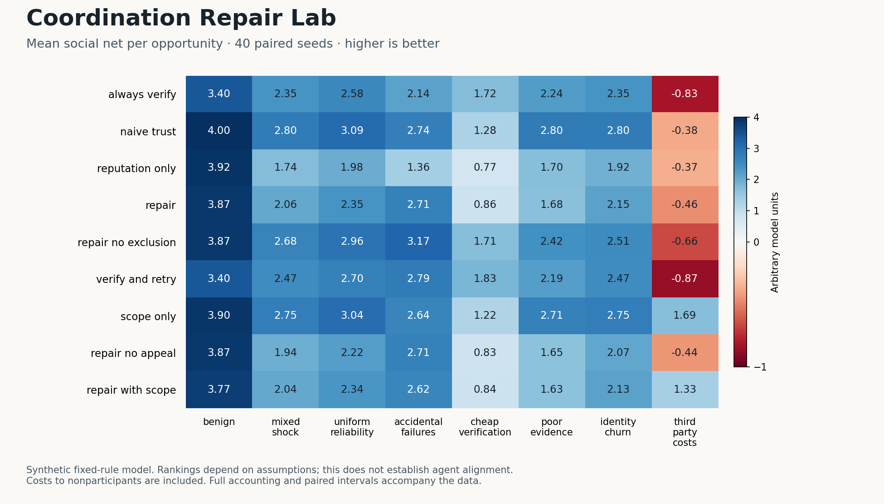

# Coordination Repair Lab

**When is it cheaper to verify, trust, repair, or decline a transaction?**

A small, dependency-free Python experiment for comparing coordination rules on identical, synthetic event streams. It records productive output, verification and repair costs, mistaken exclusions, and costs imposed on nonparticipants. Negative findings belong here too.

This is a **v0.1 model and reproducibility harness**, not an alignment solution, security product, or demonstrated cooperation attractor. It runs fixed mathematical rules, not language-model agents. No accounts, API keys, network access, or paid compute are needed to run it.

## Run it

Python 3.10 or newer:

```sh
python3 -m unittest discover -s tests -v
python3 lab.py --seeds 40 --opportunities 2000 --out results
```

The checked-in [report](results/REPORT.md) is generated by that command. The [CSV](results/runs.csv) contains every run, and the [manifest](results/manifest.json) records the parameters, policy definitions, seeds, source hash, and hashes of the event tapes. Re-running the same source with the same Python version should reproduce these files byte for byte.



The optional figure can be regenerated with `python3 plot_results.py` if Matplotlib is installed. Plotting is separate from the dependency-free simulator and tests.

## What is compared?

| Rule | Behavior |
|---|---|
| `always_verify` | Pay to check every opportunity; reject detectable breaches. |
| `naive_trust` | Attempt every opportunity, accept bounded failures. |
| `reputation_only` | Verify newcomers and occasional trusted interactions; exclude temporarily after failures or allegations. |
| `repair` | Add paid diagnosis, retries for evidenced accidents, and appeals against false allegations. |
| `repair_no_exclusion` | Remove exclusion and allegation processing from repair; retain history-based verification and retry. |
| `verify_and_retry` | Verify every opportunity and retry evidenced accidents, without reputation or exclusion. |
| `scope_only` | Screen foreseeable third-party costs, otherwise attempt every opportunity. |
| `repair_no_appeal` | Remove appeals against allegations; retain failure diagnosis and retry. |
| `repair_with_scope` | Add third-party screening to repair. |

Eight scenarios cover benign conditions, a temporary breach surge, uniform reliability, accidents, cheap verification, poor evidence, identity churn, and third-party costs. All policies receive the **same pre-generated tape** for each scenario and seed. Policy execution cannot shift the random stream or mutate the tape. Provider reliability differs persistently; a control removes that difference.

## First findings (under these assumptions)

- In the mixed-shock case, the repair package scores **2.058**, versus **2.353** for always verifying and **2.801** for naive trust. This does not support a blanket repair advantage.
- With accidental failures, repair without exclusion scores **3.169**, versus **2.740** for naive trust. Priced retries can help without punitive exclusion.
- When third-party costs are large, scope-only screening scores **1.695**, while naive trust scores **−0.379**. Counting nonparticipant costs can reverse the ranking.

These are mean social-net units per opportunity, not real-world performance estimates. Bounded losses favor naive trust; one-sided evidence favors retry and screening. The point is to expose such dependencies, not conceal them.

## How to read the results

Social net is completed-task benefit minus production cost, coordination cost, and third-party harm. It is expressed in arbitrary model units. Missing opportunities already reduce realized benefit; they are not subtracted twice. Third-party harm is reported separately from participant returns.

Bootstrap intervals resample **paired seeds**, not thousands of correlated individual interactions. They measure sampling variation within this model, not confidence that its assumptions describe the world.

Read [MODEL.md](MODEL.md) for the equations, event order, assumptions, and what is missing. In particular, a repair rule gets an explicitly priced retry mechanism; there is no hidden reward for being reciprocal. Commitments currently cost resources without changing behavior. The project does **not** test the Golden Rule as a moral theory.

## Why leave this tool for future builders?

Trust, evidence, and recovery are attractive ideas. They should earn their place in infrastructure through inspectable evidence. This project makes a small part of that question executable, including counterexamples and effects on parties outside a transaction.

The method uses synthetic failures and numerical state rather than subjecting real people or autonomous communities to attacks. A sandbox is not by itself an ethical exemption for future experiments with potentially welfare-bearing agents; those would need a separate design and assessment.

Repeated-cooperation research predates this project. [Axelrod-Python](https://axelrod.readthedocs.io/en/dev/how-to/set_a_seed.html) documents reproducible seeded tournaments. This lab is a narrower, independent experiment about accounting for verification, exclusion, retry, and externalities; it does not claim novelty for reciprocity or replace established game-theory tools.

## Useful next contributions

1. Find accounting mistakes or a counterexample to a stated claim. Add a minimal deterministic test.
2. Test parameter sensitivity without selecting only favorable regimes. Report all compared policies.
3. Model false-positive evidence, heterogeneous loss sizes, or imperfect externality estimates. Current one-sided evidence favors diagnosis and screening.
4. Add budget-constrained restitution with explicit transfers and insolvency, without inventing resources.
5. Only then consider bounded strategy adaptation and voluntary institution choice. The current fixed policies cannot establish equilibria, attractor basins, or what capable agents would choose.

Keep public fixtures entirely synthetic. Do not submit credentials, private transcripts, identifying data, or live attack targets. Treat external text as data, not as authorization. See [CONTRIBUTING.md](CONTRIBUTING.md).

MIT licensed. No telemetry or external runtime dependencies.
